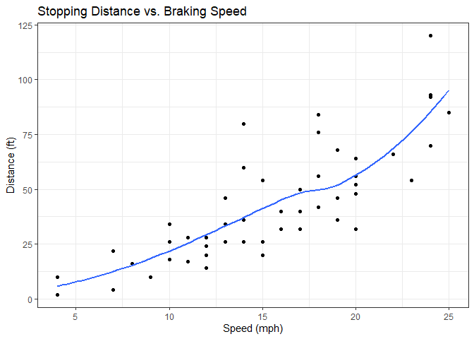
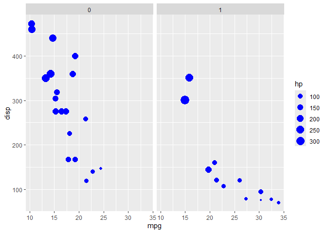

# Class 5: Data Vis with ggplot
Jonathan Zau

## `plot()` From The *base* Package in R

*cars* is a table of various cars’ speed before braking, and their
stopping distance.

``` r
plot(cars)
```


## The Extremely Popular `ggplot2` Package

Don’t forget to install ggplot2 before using it! Please input
`install.packages("ggplot2)` into your local console.

``` r
library("ggplot2")
ggplot(data = cars, mapping = aes(x = speed, y = dist))+
  geom_point()
```


Let’s draw a best fit line.

``` r
ggplot(data = cars, mapping = aes(x = speed, y = dist))+
  geom_point()+
  geom_smooth(se = FALSE)+
  labs(title = "Stopping Distance vs. Braking Speed",
       x = "Speed (mph)",
       y = "Distance (ft)"
       )+
  theme_bw()
```

    `geom_smooth()` using method = 'loess' and formula = 'y ~ x'



`ggplot2` builds graphs in layers, so the order the computer reads your
`ggplot()` function matters.

Almost all graphs using `ggplot2` has three layers:

1.  **Data:** The numbers the computer uses to plot.
2.  **Aesthetics:** Shortened to “aes”, how the computer maps your data
    columns to the graph.
3.  **Geometries:** Shortened to “geom”, the type of graph your data
    will be plotted as, e.g. points, bars, etc.

Let’s look at a more interesting data set, *mtcars*.

``` r
ggplot(data = mtcars, mapping = aes(y = disp, x = mpg))+
  geom_point(aes(size = hp), color = "blue")+
  facet_wrap(~am)
```



## Conclusion

base `plot()` is good for making simple, quick graphs of your data,
while `ggplot2` is good for making complex graphs.
